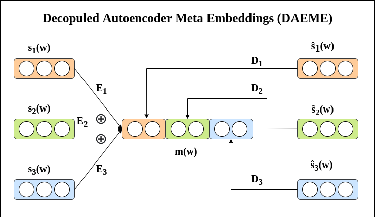
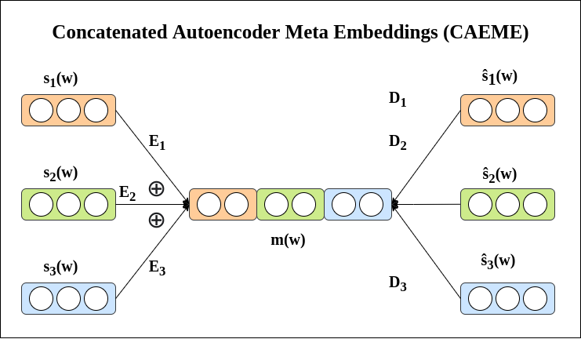
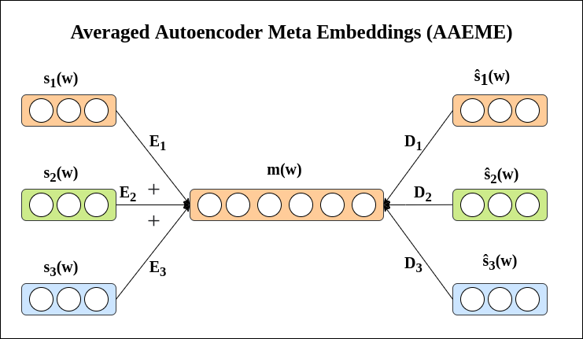

## Meta-Word-Embeddings-using-Autoencoders
* Implementation of Meta-Word-Embeddings, a combination of word2vec, GloVe, and fassttext word embeddings using various types of autoencoders.
* Implementation based on the paper **"Learning Word Meta-Embeddings by Autoencoding"**. [[paper link]](https://www.aclweb.org/anthology/C18-1140/)
* The meta-embeddings are generating using three different variants of autoencoders namely:
  * Decopuled Autoencodeder (DAE)
  * Concatenated Autoencoder (CAE)
  * Averaged Autoencoder (AAE)
* Each of them is explained below.

## Decopuled Autoencoded Meta-Embeddings (DAEME)
</image>
* The figure above shows the architecture of the Decopuled Autoencoder. 
* DAEME can be seen as an extension of naive concatenation that has non-linear neural networks applied on the raw model. Here, each encoder namely: E1, E2, and E3 can be seen as independently performing a transformation to the respective source embedding so that it can learn to retain essential information rather than simply concatenate features.
* The decoders D1, D2, and D3 independently reconstruct the source embeddings from the encoded versions of the source embeddings. Because of this behaviour we call this approach decoupled autoencoded meta-embedding.
* For the detailed explaination of DAEME, refer this [link](https://www.aclweb.org/anthology/C18-1140/).

## Concatenated Autoencoded Meta-Embeddings (CAEME)
</image>

* The figure above shows the architecture of the Concatenated Autoencoder. 
* Similar to DAEME, DAEME, the meta-embedding in CAEME is also constructed as the concatenation of the encoded source embeddings.
* However, instead of treating the meta-embedding as individual components, CAEME reconstructs the source embeddings from the same meta-embedding, thereby implicitly using both common and complementary information in the source embeddings.
* TCompared to DAEME, CAEME imposes a tighter integration between the two sources in their meta-embedding.
* For the detailed explaination of CAEME, refer this [link](https://www.aclweb.org/anthology/C18-1140/).

## Averaged Autoencoded Meta-Embeddings (AAEME)
</image>
* The figure above shows the architecture of the Averaged Autoencoder. 
* AAEME can be seen as a special case of CAEME, where we compute the meta-embedding by averaging the encoded sources embeddings instead of their concatenation.
* This operation has the benefit that we can transform the sources such that they could be averaged in the same vector space, and also guarantees orthogonality between the encoded vectors.
* For the detailed explaination of AAEME, refer this [link](https://www.aclweb.org/anthology/C18-1140/).

